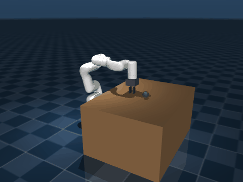

# xArm-project

> **MuJoCo 시뮬에서 RL로 학습한 정책을 실제 UFactory xArm6에 그대로 배포(sim-to-real)하는 프로젝트.**

- 시뮬레이터: MuJoCo 3.x
- RL 라이브러리: Stable-Baselines3 (PPO / SAC)
- 태스크: **Reach** — end-effector를 목표 좌표로 이동
- 배포: xArm-Python-SDK (`XArmAPI`)
- Domain Randomization (DR) + Safe-zone penalty 내장

---

## 0. 한눈에 보는 데모

### 🤖 실제 xArm6에서 동작 (Sim-to-Real)

MuJoCo 시뮬에서만 학습한 PPO 정책을 **실제 UFactory xArm6**에 그대로 배포한 모습:


학습은 시뮬에서, 배포는 실제 로봇에. 정책 코드/가중치는 한 줄도 수정하지 않음.

### 🖥️ 시뮬 데모 (9-point Grid Tour)

학습된 정책이 **Safe zone 안의 9개 점을 순서대로 찍고 home으로 복귀** 하는 모습 (시뮬, 9/9 모두 도달).

| PPO (no DR) | PPO + DR | SAC + DR |
|:---:|:---:|:---:|
|  |  |  |

빨강=현재 target, 초록=이미 다녀온 점, 회색=대기.

---

## 1. 학습한 정책이 실제 로봇에 어떻게 신호가 가는가

학습된 정책 (`.zip` 파일)이 실제 모터에 신호를 보내는 흐름:

```
┌───────────────────────────────────────────────────────────────────┐
│                         노트북 (Python)                            │
│                                                                    │
│   ┌──────────────┐    obs (joint pos·vel, ee xyz, target xyz)      │
│   │  로봇 상태   │────────────────┐                                 │
│   │   읽기       │                ▼                                 │
│   └──────────────┘    ┌────────────────────┐                       │
│         ▲             │  학습된 정책       │                       │
│         │             │  (PPO/SAC, .zip)   │                       │
│         │             │  policy.predict()  │                       │
│         │             └────────┬───────────┘                       │
│         │                      │                                   │
│         │                      ▼ action ∈ [-1, 1]^6                │
│         │           ┌──────────────────────┐                       │
│         │           │ 후처리                │                       │
│         │           │  · action × 0.05 rad │                       │
│         │           │  · joint limit clip  │                       │
│         │           │  · safe-zone guard   │                       │
│         │           └────────┬─────────────┘                       │
│         │                    │ target_q (6 joint angles, rad)      │
│         │                    ▼                                     │
│   ┌─────┴──────────────────────────────────┐                       │
│   │  XArmAPI (xArm-Python-SDK)             │                       │
│   │  arm.get_servo_angle(is_radian=True)   │ ← 상태 읽기            │
│   │  arm.get_position(is_radian=True)      │ ← TCP xyz 읽기         │
│   │  arm.set_servo_angle_j(target_q, ...)  │ → 모터 명령             │
│   └──────────┬──────────────────┬──────────┘                       │
└──────────────┼──────────────────┼──────────────────────────────────┘
               │ TCP/IP (Modbus, port 502, 50 Hz)                    
               ▼                  ▲                                  
        ┌──────────────────────────────────┐                         
        │     xArm6 컨트롤러 박스          │                         
        │   · 내부에서 FK / IK 계산         │                         
        │   · 모터 토크 컨트롤             │                         
        └────────────┬─────────────────────┘                         
                     │ 모터 명령 (CAN bus)                            
                     ▼                                               
                ┌────────┐                                           
                │  xArm6 │  ← 6-DOF 로봇 본체                         
                └────────┘                                           
```

**핵심 포인트**:
- **시뮬과 실제가 같은 인터페이스**: obs 21차원, action 6차원(joint delta) 그대로 → 정책 코드를 한 줄도 바꾸지 않고 그대로 사용
- 정책 출력은 "각 joint를 얼마나 더 돌릴까(rad)" → 후처리에서 현재 joint 각도에 더해서 절대 명령으로 변환
- 50 Hz 루프: 매 20 ms마다 상태 읽기 → 정책 추론 → 명령 송신
- **Safe-zone guard**: 매 step TCP가 안전 박스를 벗어나면 즉시 중단

---

## 2. 학습 결과 — 4가지 조합 비교

50 에피소드 deterministic 평가, success criterion: TCP↔target < 3 cm.

| # | 모델 | DR | 학습 시간 | success rate | 평균 도달 오차 | 시뮬 9-point 데모 |
|---|---|:---:|---|:---:|:---:|:---:|
| 1 | **PPO** (baseline) | ❌ | 짧음 | **86%** | 3.22 cm | 9/9 ✅ |
| 2 | **PPO + DR** ⭐ | ✅ | 김 | **86%** | 3.36 cm | 9/9 ✅ |
| 3 | **SAC** (baseline) | ❌ | 짧음 | **86%** | 3.52 cm | 9/9 ✅ |
| 4 | **SAC + DR** | ✅ | 김 | **84%** | 3.77 cm | 9/9 ✅ |

⭐ **실제 배포 권장: PPO + DR** — 시뮬 성능은 다른 조합과 비슷하지만 DR로 학습되어 실제 로봇의 마찰/지연 차이에 더 robust.

자세한 분석은 [outputs/report.md](outputs/report.md).

### 시각적 비교

| | Grid Tour (9개 점 순회) | 일반 rollout (랜덤 target) |
|---|:---:|:---:|
| **PPO** |  |  |
| **PPO + DR** |  |  |
| **SAC** |  |  |
| **SAC + DR** |  |  |

---

## 3. 레포 구조

```
xArm-project/
├── assets/                     # 시뮬 모델
│   ├── xarm6/
│   │   ├── xarm6.xml           # MuJoCo MJCF (arm + 2-finger gripper)
│   │   ├── xarm6.urdf          # URDF (xArm6 6-DOF only)
│   │   └── meshes/             # STL meshes
│   ├── scene_reach.xml         # Reach scene
│   └── scene_pick_place.xml    # (미사용)
│
├── xarm_rl/                    # Gym 환경
│   ├── __init__.py             # XArm6Reach-v0 등록
│   └── envs/
│       ├── base_env.py         # MuJoCo wrapper
│       ├── reach_env.py        # Reach + DR + safe-zone penalty
│       └── pick_place_env.py   # (미사용)
│
├── scripts/                    # 실행 스크립트
│   ├── train.py                # 학습 (PPO / SAC, --domain_rand)
│   ├── eval_headless.py        # 평가 (success rate, 디스플레이 X)
│   ├── render_gif.py           # 단일 rollout GIF 생성
│   ├── demo_grid_tour.py       # 시뮬 9-point 데모 → GIF
│   ├── deploy_real.py          # 실제 xArm6 — 단일 target reach
│   └── deploy_grid_tour.py     # 실제 xArm6 — 9-point 데모
│
├── outputs/                    # 학습 산출물 (정책 .zip + GIF + 로그)
│   ├── report.md               # 학습 결과 상세 보고서
│   ├── gif/                    # README 임베드 GIF 모음
│   ├── reach_ppo_v2/           # PPO baseline
│   ├── reach_ppo_dr/           # PPO + DR ⭐
│   ├── reach_sac_v3/           # SAC baseline
│   └── reach_sac_dr/           # SAC + DR
│
├── pyproject.toml / requirements.txt
└── README.md (이 파일)
```

---

## 4. Safe Zone — 우리가 설정한 작업 공간

xArm6 base frame 기준, **실제 컨트롤러에 등록한 안전 박스**. 시뮬과 실제에서 같은 좌표 사용.

```
좌표계: base frame, 단위 meter, +Z = 위

    z (위)
    ▲
    │       ┌──────────────┐  z = 0.60 m
    │       │              │
    │       │   SAFE BOX   │
    │       │              │
    │       └──────────────┘  z = 0.18 m
    │
    └─────────────────────────► x (앞)
            x = 0          x = 0.57 m

  x:  0.00 ~ 0.57   (앞방향   0 ~ 570 mm)
  y: -0.54 ~ 0.55   (좌우  -540 ~ 550 mm)
  z:  0.18 ~ 0.60   (높이   180 ~ 600 mm)
```

**3중 안전망**:
1. 시뮬 학습 시 target은 박스 안쪽 보수적 영역에서만 샘플링 → 정책이 박스 밖으로 안 나가도록 유도
2. 시뮬 reward에 **safe-zone penalty** → 정책이 자발적으로 박스 회피 학습
3. 실제 배포 시 매 step **hard guard** → TCP가 박스 밖이면 즉시 `STOPPING`

워크스페이스 변경 시 수정해야 할 3곳: `xarm_rl/envs/reach_env.py`, `scripts/deploy_real.py`/`deploy_grid_tour.py`, xArm Studio (제조사 GUI) safety 설정.

---

## 5. Domain Randomization (DR)

Sim-to-real gap을 줄이기 위해 학습 시 episode마다 다음을 랜덤화:

| 항목 | 의도 |
|---|---|
| Link mass | 실제 무게/적재 차이 |
| Joint friction | 마찰/마모 차이 |
| Actuator PD gains | 시뮬 PD ≠ 실제 컨트롤러 PD |
| Joint position obs noise | 엔코더 노이즈 |
| Action latency (0~2 step) | 통신/제어 지연 |

`--domain_rand` 플래그로 활성화. DR을 켜면 학습이 다소 느려지지만 **실제 로봇에서의 안정성이 향상**됩니다.

---

## 6. 학습 환경 세팅 (처음 시작하는 사람용)

### 6.1 시스템 요구사항
- Linux (Ubuntu 20.04+ 권장)
- Python **3.10+**
- GPU는 선택 — CPU만으로도 학습 완주 가능

### 6.2 설치
```bash
git clone <repo-url> xArm-project
cd xArm-project

# Python 3.11 가상환경
python3.11 -m venv .venv
source .venv/bin/activate
pip install --upgrade pip

# (a) 학습 + 시뮬만
pip install -e .

# (b) 실제 xArm6 배포까지 — xArm-Python-SDK 포함
pip install -e ".[real]"
```

### 6.3 설치 확인
```bash
python -c "
import mujoco, gymnasium as gym, stable_baselines3, xarm_rl
e = gym.make('XArm6Reach-v0')
obs, _ = e.reset(seed=0)
print('env OK, obs shape =', obs.shape)
"
```
→ `env OK, obs shape = (21,)` 이 나오면 성공.

### 6.4 학습 실행

```bash
# PPO + DR  (배포 1순위 — 권장)
python scripts/train.py --task reach --algo ppo --domain_rand \
    --out outputs/reach_ppo_dr

# SAC + DR  (배포 2순위)
python scripts/train.py --task reach --algo sac --domain_rand \
    --out outputs/reach_sac_dr
```

진행 모니터:
```bash
tensorboard --logdir outputs/
```

### 6.5 학습된 정책 평가
```bash
python scripts/eval_headless.py --task reach --algo ppo \
    --model outputs/reach_ppo_dr/final_model.zip --episodes 50
```
**`success_rate ≥ 0.80`** 이면 배포 시도 가능. 미만이면:
- 다른 체크포인트 평가 (`ckpts/*.zip` 중에 best 고르기 — 특히 SAC는 final ≠ best일 수 있음)
- seed/timesteps 조정 후 재학습

### 6.6 시뮬 데모 GIF 만들기
```bash
# 단일 rollout
python scripts/render_gif.py --task reach --algo ppo \
    --model outputs/reach_ppo_dr/final_model.zip \
    --out outputs/gif/my_rollout.gif --episodes 3

# 9-point grid tour
python scripts/demo_grid_tour.py --algo ppo \
    --model outputs/reach_ppo_dr/final_model.zip \
    --out outputs/gif/my_grid_tour.gif
```
> 두 스크립트 모두 헤드리스(DISPLAY 없는 서버)에서도 작동 — MuJoCo의 EGL offscreen 백엔드 사용.

---

## 7. 실제 xArm6 배포 (처음 시도용 단계별)

### 7.0 사전 점검 (10분)
- [ ] xArm6 컨트롤러 부팅, **E-stop 버튼 위치 확인**
- [ ] xArm Studio (제조사 GUI)로 연결, 펌웨어 최신 확인
- [ ] xArm Studio에서 수동 동작 (home 이동, joint 점프) → 모터 정상
- [ ] xArm Studio → **Settings → Safety → workspace box** 등록: `x: 0~570 mm, y: -540~550 mm, z: 180~600 mm`
- [ ] 노트북에 학습된 `final_model.zip` 복사 완료

### 7.1 노트북 ↔ xArm6 컨트롤러 연결 (5분)

컨트롤러 기본 IP: `192.168.1.199` (스크립트 default), Modbus TCP port `502`.

**단계**:

1. **노트북에 로봇팔 이더넷 케이블 연결**
   - xArm6 컨트롤러 박스의 LAN 포트 ↔ 노트북 이더넷 포트 직결
   - (또는 같은 스위치를 통한 연결 — 인터넷에는 노출하지 말 것)

2. **노트북 이더넷 속성 변경 및 IP 설정**
   - 노트북 IP를 컨트롤러와 **같은 서브넷**으로 고정 (예: `192.168.1.10/24`)
   - **Linux**:
     ```bash
     sudo ip addr add 192.168.1.10/24 dev eth0
     ```
   - **Windows**: 제어판 → 네트워크 → 어댑터 설정 → 해당 이더넷 → 속성 → IPv4 → "다음 IP 주소 사용"
     - IP 주소: `192.168.1.10`
     - mlic gmail (sangwoo ip setting 메뉴얼 참고)

3. **노트북 terminal에서 통신 확인**
   ```bash
   ping 192.168.1.199
   ```
   응답이 오면 OK. 안 오면:
   - 케이블/포트 연결 재확인
   - 노트북 IP가 정말 같은 서브넷인지 (`ip addr show` / `ipconfig`)
   - 컨트롤러가 부팅 완료됐는지

### 7.2 노트북 환경 설치 (10분)
```bash
git clone <repo-url> xArm-project
cd xArm-project
python3.11 -m venv .venv && source .venv/bin/activate
pip install -e ".[real]"   # xArm-Python-SDK 포함
# outputs/reach_ppo_dr/final_model.zip 을 USB/scp로 복사
```

### 7.3 Dry-run (실제 모터 X, 5분)
```bash
python scripts/deploy_grid_tour.py \
    --model outputs/reach_ppo_dr/final_model.zip --dry-run
```
- 스크립트가 끝까지 실행되는지
- safe-zone 가드 코드가 정상 작동하는지

확인용. (FakeArm은 진짜 FK가 없어 success rate는 부정확 — 의미 있는 검증은 실제 컨트롤러 연결 후)

### 7.4 실제 동작 — 9-point Grid Tour ⭐
```bash
python scripts/deploy_grid_tour.py \
    --model outputs/reach_ppo_dr/final_model.zip \
    --speed 30 --hz 20 --dwell 1.0
```
이 명령 한 줄로 **home → P0 → home → P1 → … → P8 → home** 자동 순회.
각 target에서 1초씩 대기 (`--dwell`).

스크립트 내부 동작:
1. `XArmAPI('192.168.1.199')` 연결
2. `motion_enable(True)` → `set_mode(1)` (servo motion) → `set_state(0)`
3. **9-point loop**: home으로 복귀 → 다음 target reach
4. 매 step:
   - `get_servo_angle()` + `get_position()` 으로 obs 구성
   - `policy.predict(obs)` 추론
   - safe-zone 가드 → 통과 시 `set_servo_angle_j(target_q)` 송신

### 7.5 점진적 검증 시나리오
1. 5 cm 짧은 이동만 → 안전 검증
2. workspace 중앙 1점 → 단일 reach
3. 모서리 1점 → 가장자리 검증
4. 9-point 전체 → 본 데모

### 7.6 문제 발생 시 대응표

| 증상 | 원인 후보 | 대응 |
|---|---|---|
| 떨림 / jitter | 한 step 명령 변화가 큼 | `--action-scale 0.03 --hz 30` |
| 안 움직임 | servo mode 진입 실패 | xArm Studio에서 motor enable 재확인 |
| 잘못된 방향 | 시뮬 ↔ 실제 HOME 자세 불일치 | 7.7 캘리브레이션 참고 |
| Safe-zone STOPPING | 정상 작동 | target 좌표 다시 확인 |

### 7.7 HOME 자세 캘리브레이션
시뮬 정책은 학습 시의 HOME 자세에서 출발한다고 가정합니다. 실제 xArm6의 home과 일치하는지 확인:

```bash
python -c "
from xarm.wrapper import XArmAPI
a = XArmAPI('192.168.1.199')
a.motion_enable(True); a.set_mode(0); a.set_state(0)
a.move_gohome(wait=True)
_, q = a.get_servo_angle()
print('real home (deg):', q[:6])
a.disconnect()
"
```
출력값이 `[0.0, -17.2, -68.8, 0.0, 86.0, 0.0]` (PPO 학습에 사용된 HOME)와 다르면 xArm Studio에서 home 자세를 재설정하거나, 코드의 `HOME_QPOS`를 실제값으로 수정 후 재학습.

### 7.8 안전 / 운영 팁
- 노트북 ↔ 컨트롤러 **직결** (인터넷에 노출 X)
- 첫 시도는 반드시 **--speed 20-30** 부터, 점진적으로 증가
- 작동 중 손이 닿는 곳에 e-stop
- 매 step 로그 저장 권장 (사후 분석용)

---

## 8. 트러블슈팅

| 문제 | 해결 |
|---|---|
| `ModuleNotFoundError: mujoco` | venv 활성화 (`source .venv/bin/activate`) 후 `pip install -e .` |
| `OpenGL platform library has not been loaded` | `MUJOCO_GL=egl` 환경변수 설정 (헤드리스 렌더링) |
| 학습이 plateau | seed 변경, timesteps 늘리기, [outputs/report.md](outputs/report.md) 의 하이퍼파라미터 분석 참고 |
| 실제에서 jitter / 떨림 | `--action-scale` 줄이기 (0.05 → 0.03), `--hz` 30으로 ↑ |
| 실제에서 컨트롤러 응답 없음 | `ping 192.168.1.199` → 케이블/IP 확인 |

---

## 9. 라이선스 / Credits

- xArm6 URDF/STL: `dynamic_handover` repo (UFactory 공식 xacro 기반)
- xArm Python SDK: [xArm-Developer/xArm-Python-SDK](https://github.com/xArm-Developer/xArm-Python-SDK)
- 학습 프레임워크: [Stable-Baselines3](https://stable-baselines3.readthedocs.io/), [Gymnasium](https://gymnasium.farama.org/), [MuJoCo](https://mujoco.org/)
